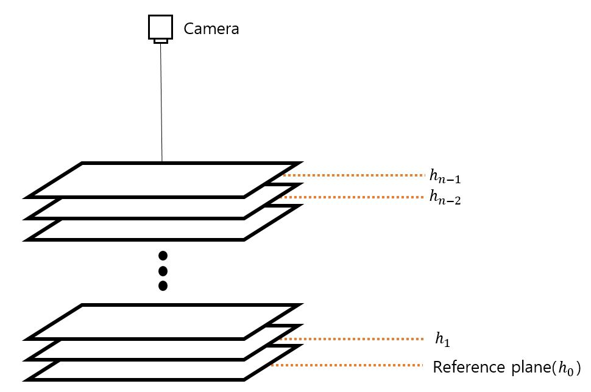

Guo's 3D Calibrations  
---
Guo's method is to obtain the 3D calibration coefficient by applying the normalization value and using the least squares method. In this experiment, the distance between the reference plane and each plane was used as the normalization value and two coefficients were used. The 3D calibration coefficient can be obtained by applying the least squares method using the phase difference between the reference plane and each plane and the actual distance. In the figure below, there are n planes starting from the reference plane and the height of the reference plane is indicated by .  

 

The method of calculating the coefficient using the least squares method is as follows.  

 

In equation 1, means the 3D calibration coefficients. This can be calculated by the formulas from Eqs. (2) to (4). means the phase difference between the reference plane and theplane. denotes the actual distance between the reference plane and the plane, and  denotes the total number of the planes. The 3D calibration coefficient can be obtained by using the least square method using the phase difference and the actual distance as described above. This coefficient is a coefficient to be obtained for every pixel of the entire image. That is, there are two coefficients for each pixel, and the height value can be calculated using this.  

### Height calculation  
Now, we can obtain the height for the input phase value by using the coefficient for height measurement for each pixel. The formula for calculating the height value is shown in Equation (5).  

 

 denotes the height of the pixel , and B denotes the phase difference between the reference plane and the object image to be measured at the pixel . Also,  and represents the 3D calibration coefficient obtained previously.
