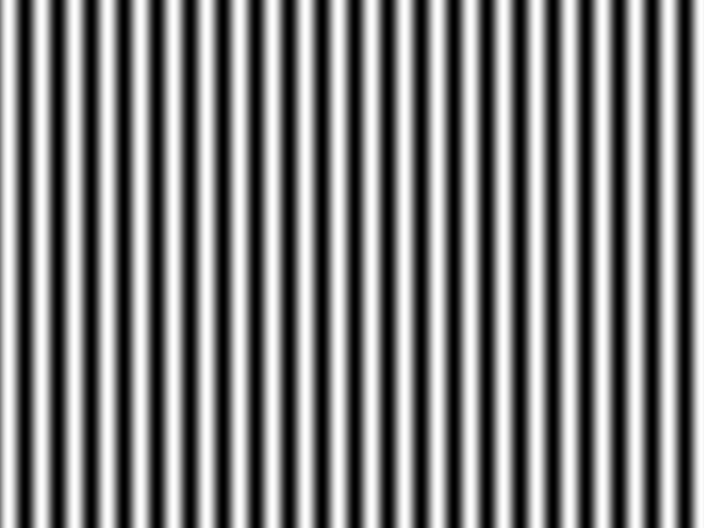

# Prior to entering...

This repository consist of some source files and some projects. Source files is common and base functions about 3D measurements. Projects is divdied into functions(ex : 3D Calibrations methods, some improving methods...)

### About .cpp files(common & base functions)...
- make_fringe_image.cpp : 'makeFringeImage' function makes the fringe pattern image.  Belows's image is an example of fringe pattern image( parameter T = 48 & vertical ). Also, 'makeFringeImage_gamma' function makes a gamma-corrected fringe pattern image. This is because sometimes the fringe pattern projected by project is distorted by gamma.  

 

- calc_phase_value_0_2Pi.cpp : 'calc_phase_value_0_2Pi' function calculates the phase values. Prior to calculateing, you have to project the fringe pattern images and grab the images.
